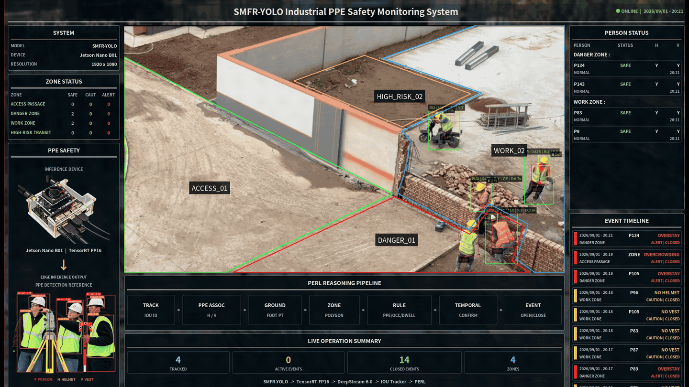

# SMFR-YOLO

SMFR-YOLO is a compact detector for industrial personal protective equipment (PPE). This repository provides the model source, reproducible data memberships and protocols, machine-readable paper results, Jetson Nano deployment resources, and the deterministic PERL monitoring application.

<p align="center">
  
</p>

<p align="center">
  <b>Compact PPE detection · Edge deployment · Deterministic video safety monitoring</b>
</p>

---

## At a glance

| Item | Description |
|---|---|
| Task | Industrial PPE detection and edge video safety monitoring |
| Detector | SMFR-YOLO |
| PPE classes | `person`, `helmet`, `vest` |
| Core mechanisms | SMIC2f, BiFPNF, DFLR |
| Input size | 640 × 640 |
| Parameters | approximately 2.16 M |
| Compute | approximately 7.9 GFLOPs |
| Primary benchmark | 1,700 images |
| External validation | CPPE |
| Edge device | Jetson Nano B01 |
| Deployment | TensorRT 8.2.1 FP16 + DeepStream 6.0 |
| Monitoring layer | PERL |
| License | AGPL-3.0 |

## Overview

SMFR-YOLO is designed for compact industrial PPE detection under constrained edge-computing budgets.

The model combines source-memory feature retention, learnable multi-scale fusion, and coarse-to-refined distributional box regression. The resulting network has approximately 2.16 million parameters and uses approximately 7.9 GFLOPs at 640-pixel input size.

Beyond detector accuracy, this repository provides the reproducibility resources used for external-domain evaluation, five-fold validation, statistical analysis, Jetson Nano deployment, and deterministic perception-to-event reasoning.

## Method

### SMIC2f

SMIC2f retains source features across recursive feature transformations through a learned memory coefficient.

### BiFPNF

BiFPNF learns normalized weights at five multi-scale fusion nodes in the detection neck.

### DFLR

DFLR refines coarse distributional box predictions with scale-dependent residual corrections.

The repository preserves the actual implementation modules used for the frozen experimental checkpoints and model definitions.

## Repository structure

```text
SMFR-YOLO/
├── assets/                  # demo media and release artwork
├── configs/                 # training and evaluation configurations
├── data/                    # dataset documentation and exact memberships
├── deployment/              # ONNX, TensorRT, and DeepStream resources
├── model/
│   ├── modules/
│   │   ├── smic2f.py
│   │   ├── bifpnf.py
│   │   └── dflr.py
│   ├── patches/
│   └── smfr_yolo.yaml
├── perl/                    # deterministic perception-to-event reasoning
├── results/                 # machine-readable paper results
├── scripts/                 # preparation, training, evaluation, and export
├── .gitignore
├── LICENSE
├── NOTICE
├── README.md
└── requirements.txt
```

## Reproducibility resources

This repository includes:

- **Model source** for the SMFR-YOLO topology and its three core mechanisms.
- **Primary benchmark memberships** and dataset preparation resources.
- **CPPE external-validation protocols** for zero-shot and retraining evaluation.
- **Five-fold validation resources** with a common held-out test set.
- **Machine-readable paper results** under `results/`.
- **Paired statistical analysis resources** for fixed-test-set comparison.
- **ONNX / TensorRT / DeepStream deployment resources** for Jetson Nano.
- **PERL monitoring logic** for PPE association, zone reasoning, dwell, occupancy, and event generation.

## Installation

SMFR-YOLO is based on THU-MIG/yolov10 at commit:

```text
453c6e38a51e9d1d5a2aa5fb7f1014a711913397
```

A representative installation procedure is:

```bash
export SMFR_REPO=/absolute/path/to/SMFR-YOLO

git clone https://github.com/THU-MIG/yolov10.git
cd yolov10
git checkout 453c6e38a51e9d1d5a2aa5fb7f1014a711913397

cp "$SMFR_REPO"/model/modules/*.py ultralytics/nn/modules/

git apply "$SMFR_REPO/model/patches/modules_init.patch"
git apply "$SMFR_REPO/model/patches/tasks.patch"

cp "$SMFR_REPO/model/smfr_yolo.yaml" ultralytics/cfg/models/v8/smfr_yolo.yaml

python -m pip install torch==2.5.1 torchvision==0.20.1 --index-url https://download.pytorch.org/whl/cu121
python -m pip install -e .
python -m pip install -r "$SMFR_REPO/requirements.txt"

cd "$SMFR_REPO"
```

The formal PC environment used:

- Python 3.9.7
- PyTorch 2.5.1+cu121
- CUDA 12.1

The explicit PyTorch installation command above installs the intended CUDA build before the editable upstream package can resolve a different build.

## Data

### ITPPE

ITPPE (Industrial Target-domain Personal Protective Equipment Dataset) is an author-collected industrial-scene PPE dataset containing:

- 494 images
- 7,163 annotated object instances
- 2,942 `person` instances
- 2,509 `helmet` instances
- 1,712 `vest` instances

The fixed split used in this study contains:

- 454 training images
- 20 validation images
- 20 held-out test images

During double-anonymized peer review, the complete ITPPE image-and-annotation archive is available through the anonymous Zenodo reviewer-access link supplied with the manuscript.

The secret reviewer URL is intentionally not embedded in this public repository.

See:

```text
data/itppe/README.md
```

for archive structure and primary-benchmark reconstruction instructions.

### RF100 Construction Safety v2

The primary benchmark uses 1,206 upstream images from RF100 Construction Safety.

Original RF100 images are not redistributed in this repository.

The manually reviewed and refined annotations used in the paper are provided under:

```text
data/rf100_v2/labels/
```

Related manifests and mappings are also provided under:

```text
data/rf100_v2/
```

### Primary benchmark

The combined primary benchmark contains:

- 1,700 images
- 14,559 annotated instances
- 1,451 training images
- 139 validation images
- 110 held-out test images

Exact memberships are provided under:

```text
data/primary_benchmark/
```

The five-fold protocol uses a 1,590-image development pool while preserving the same 110-image held-out test set for every fold.

### CPPE

The external-domain evaluation uses the fixed CPPE split:

- Train746
- Val93
- Test93

Two protocols are reported.

**Protocol A — zero-shot external validation**

The primary-domain checkpoint is directly evaluated on CPPE Test93 without CPPE training.

**Protocol B — external-domain retraining validation**

The model is trained from scratch on CPPE Train746, selected using Val93, and finally evaluated on Test93.

Exact memberships and protocol configuration are under:

```text
data/cppe/
```

## Primary dataset preparation

After obtaining the required source images, assemble the primary benchmark with:

```bash
python scripts/prepare_primary_dataset.py \
  --rf100-root path/to/rf100 \
  --itppe-root path/to/ITPPE \
  --output path/to/primary
```

The `--itppe-root` argument should point to the extracted `ITPPE/` directory containing:

```text
images/
labels/
```

## Training

Formal training uses:

| Setting | Value |
|---|---:|
| Epochs | 100 |
| Image size | 640 |
| Batch size | 16 |
| Seed | 42 |
| Optimizer | SGD |
| Initial learning rate | 0.01 |
| Momentum | 0.937 |
| Weight decay | 0.0005 |
| AMP | disabled |
| Mosaic | 1.0 |
| Close mosaic | 15 |
| MixUp | 0.05 |
| Erasing | 0.30 |

The complete configuration is provided in:

```text
configs/train.yaml
```

A representative training command is:

```bash
python scripts/train.py \
  --data path/to/primary/dataset.yaml \
  --device 0
```

The publication configuration uses the model YAML as the architecture starting point. Although the Ultralytics `pretrained` option is true, no checkpoint path is supplied, so the model is initialized from the architecture rather than from pretrained weights.

## Evaluation

Formal validation and test evaluation use:

- image size 640
- batch size 32 where supported
- `half: false`

The corresponding configuration is provided in:

```text
configs/evaluate.yaml
```

### Primary benchmark

```bash
python scripts/evaluate.py \
  --checkpoint path/to/best.pt \
  --data path/to/primary/dataset.yaml \
  --split test
```

### Five-fold validation

```bash
python scripts/validate_five_fold.py
```

### CPPE preparation

Prepare CPPE once before running either external-validation protocol:

```bash
python scripts/prepare_cppe.py \
  --source path/to/cppe \
  --output path/to/cppe_yolo
```

### CPPE Protocol A

```bash
python scripts/run_cppe.py \
  --protocol a \
  --model path/to/primary_best.pt \
  --data path/to/cppe_yolo/dataset.yaml
```

### CPPE Protocol B

```bash
python scripts/run_cppe.py \
  --protocol b \
  --model model/smfr_yolo.yaml \
  --data path/to/cppe_yolo/dataset.yaml
```

### Statistical analysis

```bash
python scripts/analyze_statistics.py
```

The paired analysis uses fixed-test-set per-image AP50 measurements.

## Paper results

Machine-readable source data corresponding to the manuscript are provided under `results/`.

| Paper content | Source data |
|---|---|
| Model comparison | `results/benchmark/model_comparison.tsv` |
| Accuracy / complexity summary | `results/benchmark/accuracy_complexity.tsv` |
| Complete module ablation | `results/ablation/module_ablation.tsv` |
| DFLR strength sensitivity | `results/ablation/dflr_strength_sensitivity.tsv` |
| Paired statistical tests | `results/statistics/` |
| Object-scale analysis | `results/scale/` |
| High-IoU analysis | `results/scale/` |
| Five-fold comparison | `results/five_fold/` |
| CPPE external evaluation | `results/cppe/` |
| Jetson Nano benchmark | `results/deployment/nano_benchmark.tsv` |
| SMIC2f analysis | `results/mechanism/smic2f/` |
| BiFPNF analysis | `results/mechanism/bifpnf/` |
| DFLR analysis | `results/mechanism/dflr/` |

## Jetson Nano deployment

The edge deployment environment used:

| Component | Configuration |
|---|---|
| Device | Jetson Nano B01 |
| Precision | FP16 |
| Batch size | 1 |
| TensorRT | 8.2.1 |
| DeepStream | 6.0 |
| CUDA | 10.2 |
| ONNX opset | 12 |
| Input | `[1, 3, 640, 640]` |
| Output | `[1, 8400, 6]` |

The final deployment uses the inference-completion compatibility correction documented under:

```text
deployment/deepstream/nvdsinfer/event_host_wait.patch
```

Deployment instructions and parser details are documented in:

```text
deployment/README.md
```

Parser hardening and runtime synchronization are documented separately because they serve different purposes.

## PERL

PERL (Perception-to-Event Reasoning Layer) is the deterministic engineering layer used to convert tracked detections into zone-aware PPE, occupancy, dwell, and event-lifecycle outputs.

The repository provides the reference runtime implementation in `perl/perl_runtime.py`. Scene-specific polygon coordinates, rule thresholds, and timing configurations used for the demonstration videos are intentionally omitted because they are application-specific rather than detector-training parameters.

PERL is not an additional learned model.

## Demo

The animation shown at the top of this README demonstrates the end-to-end edge monitoring workflow, including detection, tracking, PPE association, zone-aware reasoning, and event reporting.

The source asset is:

```text
assets/smfr_yolo_edge_monitoring_demo.gif
```

## Anonymous review note

This repository is maintained as an anonymous reproducibility resource for double-anonymized peer review.

No author identity, institutional affiliation, private email address, local research path, or private dataset-review token is intentionally included in the public repository.

The anonymous ITPPE reviewer-access URL is supplied separately with the manuscript.

## License

The code is distributed under AGPL-3.0.

`NOTICE` records the exact upstream revision and DeepStream parser attribution.